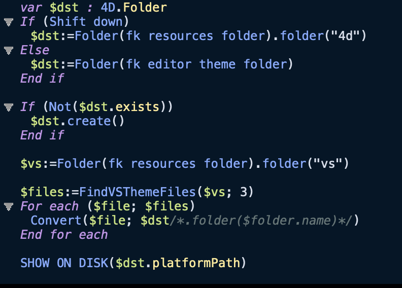

# Night Owl 4D Theme

Based entirely on Sarah Drasner's [Night Owl VSCode Theme](https://github.com/1bharat/night-owl-alfred-theme).



## To install on macOS

Open a terminal and type

```bash
curl -sL https://raw.githubusercontent.com/mesopelagique/night-owl-4d-theme/main/Night%20Owl-Light-color-theme.json -o $HOME/Library/Application\ Support/4D/4D\ Editor\ Themes/Night\ Owl-Light-color-theme.json
```

Then select it in 4D v19+ preferences.

## Others

### Convert any visual studio code theme to 4D theme

https://github.com/mesopelagique/VSThemeConverter

### Other components

[](https://mesopelagique.github.io/)
